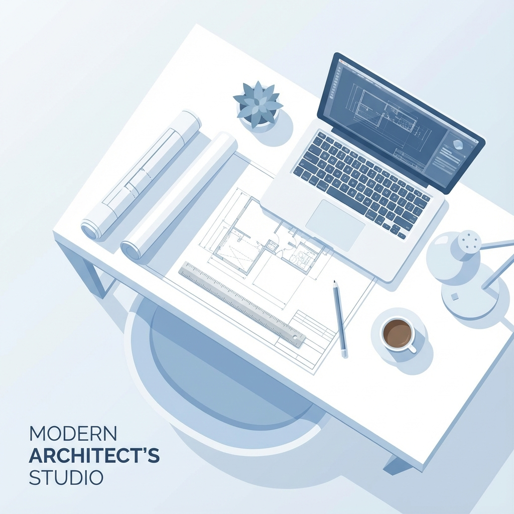

# LearnArchi - Beyond the Classroom



A modern, interactive landing page for LearnArchi - a global community built by and for architecture students, focused on clear thinking, honest process, and confident growth.

## 🌟 Overview

LearnArchi bridges the gap between architectural education and professional practice. This landing page showcases our mission, methodology, and community benefits through a beautiful, modern web experience.

## ✨ Features

### 🎨 Design & UI

- **Modern Glassmorphism** - Floating navigation with frosted glass effect
- **3D Image Effects** - Interactive images with perspective, tilt, and depth
- **Smooth Animations** - Floating elements, hover effects, and micro-interactions
- **Gradient Backgrounds** - Subtle gradients throughout for visual depth
- **Responsive Design** - Fully optimized for desktop, tablet, and mobile

### 🎯 Key Sections

1. **Hero Section** - Eye-catching introduction with workspace illustration
2. **Mission Statement** - Clear articulation of the education-practice gap
3. **Methodology** - 5 core learning principles in card layout
4. **Benefits** - What members get from the community
5. **Vision** - Future roadmap and goals
6. **Join CTA** - Interactive modal with Telegram & WhatsApp links

### 🚀 Interactive Elements

- **Join Modal** - Beautiful popup with social platform options
- **3D Image Hover** - Images tilt and lift on hover
- **Smooth Scrolling** - Animated scroll indicator
- **Navigation Links** - Smooth scroll to sections

## 🛠️ Tech Stack

- **Framework**: [Next.js 16.1.0](https://nextjs.org/) (App Router)
- **Language**: TypeScript
- **Styling**: CSS Modules
- **Fonts**: Inter (UI) & Source Serif 4 (Content)
- **Image Optimization**: Next.js Image component
- **Deployment Ready**: Vercel, Netlify, or any Node.js host

## 📦 Installation

### Prerequisites

- Node.js 18.x or higher
- npm or yarn package manager

### Setup

1. **Clone the repository**

   ```bash
   git clone https://github.com/yourusername/learn-archi.git
   cd learn-archi
   ```

2. **Install dependencies**

   ```bash
   npm install
   # or
   yarn install
   ```

3. **Run development server**

   ```bash
   npm run dev
   # or
   yarn dev
   ```

4. **Open in browser**
   ```
   http://localhost:3000
   ```

## 🏗️ Project Structure

```
learn-archi/
├── public/
│   └── images/              # Static images
│       ├── hero-workspace.png
│       ├── education-gap.png
│       ├── community.png
│       └── principles.png
├── src/
│   ├── app/
│   │   ├── globals.css      # Global styles & CSS variables
│   │   ├── layout.tsx       # Root layout with fonts
│   │   └── page.tsx         # Main page component
│   └── components/
│       ├── Navigation.tsx   # Floating nav with glassmorphism
│       ├── Hero.tsx         # Hero section with 3D image
│       ├── WhySection.tsx   # Mission statement
│       ├── HowSection.tsx   # Methodology cards
│       ├── WhatWeDo.tsx     # Benefits section
│       ├── FutureVision.tsx # Vision & roadmap
│       ├── FinalCTA.tsx     # Join call-to-action
│       ├── JoinModal.tsx    # Interactive join popup
│       ├── Footer.tsx       # Footer with links
│       └── ClientLayout.tsx # Client-side wrapper
└── README.md
```

## 🎨 Design System

### Color Palette

```css
--color-background: #ffffff
--color-foreground: #1a1a1a
--color-accent-blue: #4d6cff
--color-muted: #6b7280
--color-border: #e5e7eb
--color-light-bg: #f9fafb
```

### Typography

- **UI Elements**: Inter (300, 400, 500, 600, 700, 800)
- **Content**: Source Serif 4 (400, 600)

### Spacing Scale

```css
--spacing-xs: 8px
--spacing-sm: 16px
--spacing-md: 24px
--spacing-lg: 48px
--spacing-xl: 80px
--spacing-2xl: 120px
```

## 🔧 Customization

### Update Social Links

Edit the modal links in `src/components/JoinModal.tsx`:

```tsx
// Line 28-30
href = "https://t.me/YOUR_TELEGRAM_GROUP";

// Line 42-44
href = "https://chat.whatsapp.com/YOUR_WHATSAPP_INVITE";
```

### Change Colors

Update CSS variables in `src/app/globals.css`:

```css
:root {
  --color-accent-blue: #YOUR_COLOR;
  /* ... other variables */
}
```

### Add/Remove Sections

Edit `src/app/page.tsx` to add or remove components:

```tsx
export default function Home() {
  return (
    <>
      <Hero />
      <WhySection />
      {/* Add your custom section here */}
      <HowSection />
      {/* ... */}
    </>
  );
}
```

## 📱 Responsive Breakpoints

- **Desktop**: 1200px+
- **Tablet**: 768px - 1199px
- **Mobile**: < 768px

All components include mobile-optimized styles using CSS media queries.

## 🚀 Deployment

### Vercel (Recommended)

1. Push code to GitHub
2. Import project in [Vercel](https://vercel.com)
3. Deploy automatically

### Netlify

1. Connect repository
2. Build command: `npm run build`
3. Publish directory: `.next`

### Manual Build

```bash
npm run build
npm start
```

## 🎯 Performance Optimizations

- ✅ Next.js Image optimization
- ✅ CSS Modules for scoped styling
- ✅ Font optimization with `next/font`
- ✅ Lazy loading for images
- ✅ Minimal JavaScript bundle
- ✅ Static generation where possible

## 🤝 Contributing

Contributions are welcome! Please follow these steps:

1. Fork the repository
2. Create a feature branch (`git checkout -b feature/AmazingFeature`)
3. Commit changes (`git commit -m 'Add AmazingFeature'`)
4. Push to branch (`git push origin feature/AmazingFeature`)
5. Open a Pull Request

## 📄 License

This project is licensed under the MIT License - see the [LICENSE](LICENSE) file for details.

## 🙏 Acknowledgments

- Design inspiration from modern architecture websites
- Community feedback and suggestions
- Next.js team for the amazing framework

## 📞 Contact

- **Website**: [learnarchi.com](https://learnarchi.com)
- **Telegram**: [t.me/learnarchi](https://t.me/learnarchi)
- **WhatsApp**: [Join Community](https://chat.whatsapp.com/learnarchi)
- **Email**: hello@learnarchi.com

---

**Built with ❤️ for architecture students worldwide**

_LearnArchi - Where architecture students grow beyond the classroom_
